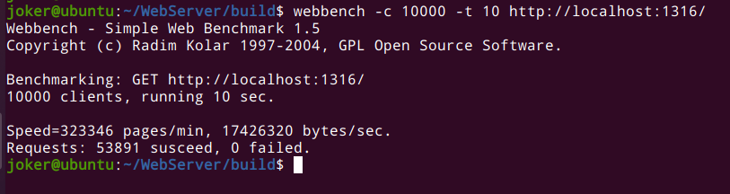

# Linux C++ WebServer

`Linux`平台下，使用C++11 实现的高性能Web服务器，使用了大量的C++11新特性，如：`thread`，`mutex`，`condition_variable`，`lock_guard`等多线程开发技术。经过`webbench`压力测试可以实现上万的QPS。



### 项目和功能

-   项目利用IO多路复用技术 `Epoll` ，线程池与连接池实现多线程的`Reactor`高并发服务器。
-   利用正则与状态机解析 `HTTP` 请求报文，实现静态资源的请求处理。
-   利用 `RAII` 机制实现了数据库连接池，减少数据库建立与关闭的开销。
-   使用命令模式实现异步任务处理，完成对客户端数据的读写和客户端超时关闭的处理。
-   基于小根堆实现定时器，关闭超时的非活动连接。
-   利用单例模式和阻塞队列实现异步日志系统，记录服务器运行状态。
-   利用 STL 中 `vector` 封装 char ，实现自动增长的缓冲区。

### 环境要求

-   `Linux`
-   `C++ 14`
-   `MySQL`
-   `CMake`

### 代码目录树

```
code
├── buffer
│   ├── buffer.cpp
│   └── buffer.h
├── http
│   ├── httpconn.cpp
│   ├── httpconn.h
│   ├── httprequest.cpp
│   ├── httprequest.h
│   ├── httpresponse.cpp
│   └── httpresponse.h
├── log
│   ├── blockqueue.h
│   ├── log.cpp
│   └── log.h
├── main.cpp
├── pool
│   ├── sqlconnpool.cpp
│   ├── sqlconnpool.h
│   ├── sqlconnRAII.h
│   └── threadpool.h
├── server
│   ├── epoller.cpp
│   ├── epoller.h
│   ├── webserver.cpp
│   └── webserver.h
└── timer
    ├── heaptimer.cpp
    └── heaptimer.h

6 directories, 22 files
```

### 项目配置和构建

-   数据库配置

    ```sql
    create database webserver;
    
    use webserver;
    
    create table user(
    username char(50) NOT NULL,
    password char(50) NOT NULL,
    primary key(username)
    )ENGINE=InnoDB DEFAULT CHARSET=utf8;
    
    insert into user(username,password) values('username','password');
    
    ```

-   项目构建和运行

    ```bash
    # 使用CMake进行外部构建
    # 1.进入build目录下
    # 2.执行以下命令
    cmake ..
    make
    # 3.启动服务器
    ./server
    ```

### 压力测试

-   测试环境：虚拟机 Ubuntu 20.4  CPU：AMD R7 4800U	内存：8G
-   QPS 10000+

```bash
webbench -c 10000 -t 10 http://ip:port/
```

